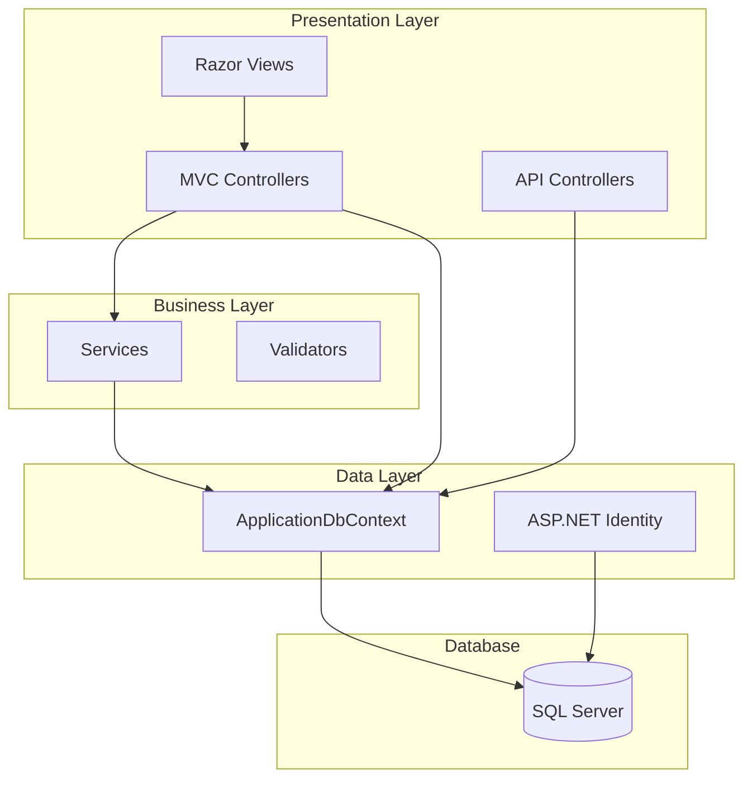
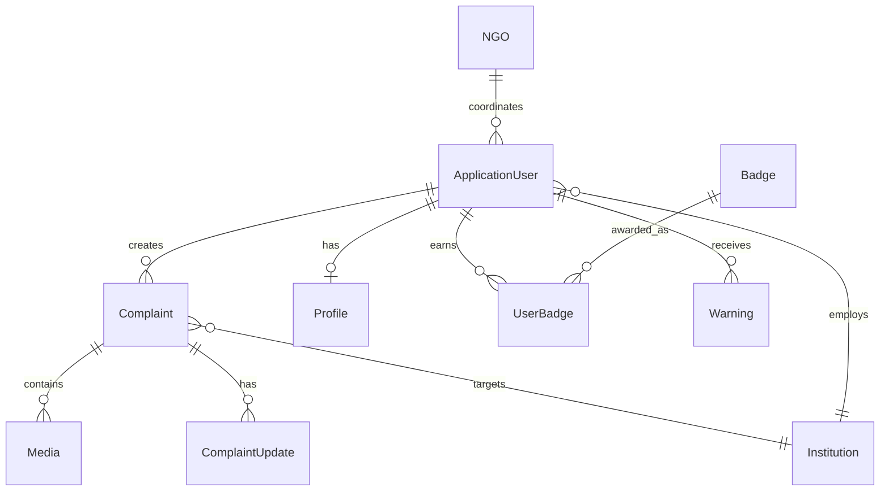

# Sistem Mimarisi

## Genel Bakış

## Bileşen Dökümü

### Controllers (7+)
| Controller | Rol | Sayfalar |
|------------|-----|----------|
| HomeController | Genel | Index |
| AccountController | Auth | Login, Register, Logout |
| CitizenController | Vatandaş | Dashboard, CreateComplaint, MyComplaints |
| InstitutionController | Kurum | Dashboard, IncomingComplaints, ManageComplaint |
| AdminController | Admin | Dashboard, Users, Complaints |
| ModeratorController | Moderatör | Dashboard, ReviewContent |
| NGOController | STÖ | Dashboard, Profile |

### Models (12 Entity)
| Model | İlişkiler |
|-------|-----------|
| ApplicationUser | → Profile, Complaints, Badges, Warnings |
| Profile | → User |
| Institution | → Complaints |
| NGO | → Users |
| Complaint | → User, Institution, Media, Updates |
| ComplaintUpdate | → Complaint |
| Media | → Complaint |
| Badge | → UserBadges |
| UserBadge | → User, Badge |
| Warning | → User |
| BannedUser | → User |
| AuditLog | - |

### Enums (5)
- ComplaintStatus
- ComplaintType
- MediaType
- UserLevel
- UserRole

## Veritabanı İlişkileri

## Güvenlik Mimarisi
- CSRF koruması (ValidateAntiForgeryToken)
- Şifre gereksinimleri (8+ karakter, mixed case, digit, special)
- Hesap kilitleme (5 deneme → 10 dakika)
- Role-based access control
- Policy-based authorization
